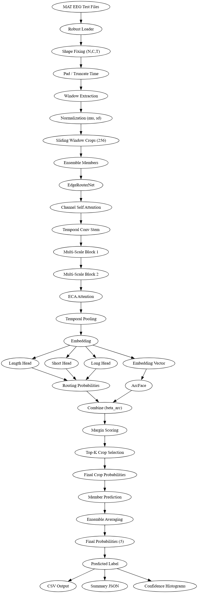

# BCI Imagined Speech Decoding

[](https://opensource.org/licenses/MIT)
[](https://www.python.org/downloads/release/python-3100/)

Modularized training pipeline for imagined speech decoding from EEG signals, targeting the **IEEE DELCON 2026** conference. This repository implements a SOTA architecture, **EdgeRouterNet**, optimized for the KaraOne dataset.

## Overview



Imagined speech decoding for Brain-Computer Interfaces (BCIs) interprets neural signals generated when a person mentally simulates speaking. This system:
- Extracts multi-scale temporal features with **Channel Self-Attention**.
- Utilizes a **hierarchical classification** approach (EdgeRouterNet).
- Employs **ArcFace** metric learning for robust embedding space.
- Features a leakage-safe 5-fold cross-validation and ensemble strategy.

## Key Features

- **EdgeRouterNet Architecture**: Multi-scale 1D-CNN with attention mechanisms.
- **Metric Learning**: ArcFace loss for enhanced class separability.
- **Ensemble Strategy**: Combines three model variants (Member A, B, C) with different kernel scales.
- **Robust Preprocessing**: Integrated artifact removal and sliding window crop generation.

## Repository Structure

```
BITS/
├── src/                # Modular source code
├── tests/              # Basic test suite
├── .github/            # Issue and PR templates
├── run.py              # Main CLI entry point
├── Makefile            # Automation targets
├── requirements.txt    # Project dependencies
├── LICENSE             # MIT License
├── CONTRIBUTING.md     # Contribution guidelines
├── CODE_OF_CONDUCT.md  # Community standards
├── SECURITY.md         # Security policy
└── README.md           # Documentation
```

## Getting Started

### 1. Installation

```bash
# Clone the repository
git clone https://github.com/your-username/bits.git
cd BITS

# Install dependencies
make setup
```

### 2. Development & Testing

```bash
# Run tests
make test

# Lint code
make lint

# Generate mock data
make data-mock
```

### 3. Data Preparation

Place your KaraOne `.mat` files in the `data/karaone/` directory.

If you don't have the dataset yet, you can generate synthetic mock data to test the pipeline:
```bash
make data-mock
```

### 3. Running the Pipeline

To run the complete 5-fold CV and final model fit:
```bash
make run DATA_DIR=./data/karaone
```

Or manually using `run.py`:
```bash
python run.py --data_dir ./data/karaone --mode both --tag EXPERIMENT_01
```

## Citation

If you use this codebase in your research, please cite our target paper for DELCON 2026:

```bibtex
@inproceedings{delcon2026imagined,
  title={SOTA Imagined Speech Decoding via EdgeRouterNet and Metric Learning},
  author={Varun et al.},
  booktitle={5th IEEE Delhi Section Flagship Conference (DELCON 2026)},
  year={2026}
}
```

## License

This project is licensed under the **MIT License** - see the [LICENSE](LICENSE) file for details.
